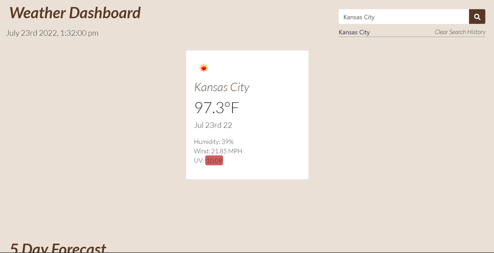

# Weather-Dashboard

This project was completed for KU's coding boot camp assignment 6. 

The goal of this project was to create responsive website that displays the weather of any givin city and a 5 day forecast.

## Check out the Project
Check out the different aspects of the project below:

- [GitHub Page](https://johnathanmann.github.io/Weather-Dashboard/)
- [Repository](https://github.com/johnathanmann/Weather-Dashboard)
- [Video of deployed application](https://drive.google.com/file/d/1ii_v0yNJdjf6-GYZvWohaS0N2v_hcylY/view)

## Install
Feel free to install using GitHubs recommended clone methods or by downloading the code and opening it in your preferred text editor.

## Requirements
To use the project all you need is a browser, but to access the code you need your text editor of choice.

## Summary
This site allows you to find the weather of any city along with a 5 day forecast. This is done through OpenWeather's One Call API 3.0. This project also utilizes Bootstrap 4 and JQuery. Your past searches are saved in a search history, but they can be cleared.
